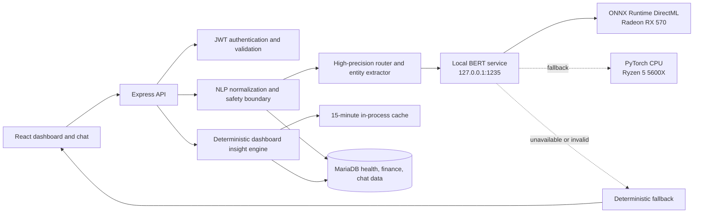

# LifeSync Local BERT Integration and QA Report

**Report date:** 21 June 2026  
**Environment:** Windows; AMD Ryzen 5 5600X (6 cores / 12 threads); AMD Radeon RX 570 4 GB  
**Target artifact:** `bert_best_model_10pct`  
**System under test:** LifeSync health and financial tracking application  
**Assessment status:** **Integrated and locally verified; hybrid routing required because raw classifier quality is below release threshold**

## 1. Executive decision

The supplied model is fully connected to LifeSync and is running locally. The artifact is a 109,486,854-parameter, float32 `BertForSequenceClassification` model with six labels: `general_chat`, `log_both`, `log_expense`, `log_health`, `query_summary`, and `set_goal`. Its weights SHA-256 is `43d261fa1bf0444f781298c241518563274801cf57c544d8ba3c9b0c069358e2`.

This BERT is an encoder-only intent classifier. It cannot generate conversational prose or dashboard narratives. LM Studio is therefore not the correct runtime for this artifact: LM Studio's chat path expects a generative model, while this artifact contains Hugging Face `safetensors` plus tokenizer/config files. The implemented production-safe architecture uses BERT for intent evidence, deterministic validated extraction for health/finance entities, templated chat responses, and deterministic dashboard calculations. The existing LM Studio provider remains optional if a separate generative model is later desired.

The RX 570 executes the exported ONNX graph through ONNX Runtime DirectML. It is the recommended runtime on this machine: median model inference was **15.998 ms** and sequential throughput **62.24 requests/second**, versus **44.357 ms** and **17.11 requests/second** through six-thread PyTorch CPU. Both produced the same raw predictions and **68.33%** accuracy on the fixed 60-case balanced set.

Raw BERT is not strong enough to own writes by itself. On an independent 30-case shadow set it achieved **60.00% accuracy / 49.44% macro F1** and was often confidently wrong. The hybrid router achieved **96.67% accuracy / 96.63% macro F1** on that shadow set without modifying rules after seeing it. Therefore the model is useful as one signal, while rules, schema validation, clarification handling, and controller checks remain mandatory safety boundaries.

## 2. Scope, evidence, and limitations

### 2.1 In scope

- Inspection, hashing, export, and execution of the exact supplied BERT artifact.
- Local PyTorch CPU and ONNX Runtime DirectML GPU runtimes.
- BERT intent integration for chat and deterministic dashboard operation.
- Authentication, health-log, finance-log, dashboard, and chat regression coverage.
- Deterministic safety controls and model fallback behavior.
- Balanced and independent-shadow model evaluation, latency, throughput, and determinism measurement.
- Requirements analysis based on `usecase_diagram_updated.pdf`.
- Professional use-case specifications and traceability.

### 2.2 Evidence sources

- The checked-out source code and database schema.
- The supplied use-case diagram.
- Live local API/UI executions on 20 June 2026.
- The supplied `config.json`, tokenizer, and `model.safetensors` artifact.
- PyTorch CPU and ONNX Runtime DirectML executions on the named hardware.
- Jest, Playwright, Vite, npm audit, and the model-evaluation JSON artifacts.

### 2.3 Boundaries

- Model quality figures describe the checked-in evaluation cases, not clinical or financial safety certification.
- The independent shadow set has 30 cases; a larger human-reviewed holdout is required before public release.
- The classifier does not generate text. Dashboard scores and narratives currently remain deterministic and auditable.
- Weekly download, scheduled notifications, external synchronization, and complete administration flows shown in the supplied diagram are not fully implemented.

## 3. Implemented architecture



### 3.1 Provider and runtime boundary

`server/services/ai/providerClient.js` recognizes `bert_local`, calls the classifier endpoint, and keeps status information free of secrets:

```js
if (provider === 'bert_local') {
  const baseUrl = (process.env.BERT_RUNTIME_BASE_URL
    || 'http://127.0.0.1:1235').replace(/\/$/, '');
  return {
    provider,
    model: process.env.BERT_MODEL_NAME || 'bert_best_model_10pct',
    endpoint: `${baseUrl}/v1/classify`,
    statusEndpoint: `${baseUrl}/v1/status`,
  };
}
```

The DirectML service uses overlapping 128-token windows with a 32-token stride. It executes every window through the same ONNX graph, combines 75% max pooling with 25% mean pooling, and returns primary intent, strong secondary intents, per-window evidence, truncation count, and measured latency. This preserves intent evidence near the end of long messages without changing model weights. The PyTorch service remains the CPU fallback.

```js
const result = await classifyText(message);
return {
  label: result.label,
  confidence: result.confidence,
  provider: result.provider,
  inference_latency_ms: result.inference_latency_ms,
};
```

### 3.2 Health/status contract

Authenticated `GET /api/ai/status` returns chat and insight readiness snapshots. It reports provider, model, architecture, task, execution provider, labels, artifact hash, and runtime metrics, but never returns credentials.

```js
const runtime = await axios.get(settings.statusEndpoint);
return { ...base, status: runtime.data.status, ...runtime.data };
```

### 3.3 Chat safety boundary

`bertNlpService.js` combines model evidence with high-precision routing, deterministic entity extraction, normalization, and positive-value checks. It enforces two safety invariants:

```js
const needsClarification = queryIntent
  ? false
  : Boolean(parsed.needs_clarification);
const entities = needsClarification ? [] : validatedEntities;
```

If input is ambiguous, no actionable entity leaves the service. The chat controller independently refuses persistence while clarification is pending. This is defense in depth.

### 3.4 Dashboard design

`server/services/ai/dashboardInsightsService.js` recognizes that BERT is classifier-only. Health score, financial score, trend calculations, budget facts, patterns, recommendations, and narrative all remain deterministic. Runtime metadata makes that decision visible instead of pretending BERT generated prose.

```js
const deterministic = await runInsightEngine(userId);
if (providerStatus.task === 'single_label_classification') {
  return {
    ...deterministic,
    metadata: {
      ...deterministic.metadata,
      mode: 'bert_classifier_with_deterministic_dashboard',
    },
  };
}
```

Dashboard results are cached for 15 minutes. A runtime failure uses deterministic fallback and a short cache, allowing quick recovery.

### 3.5 Front-end latency isolation

Core dashboard health and finance calls no longer wait for the slower model insight call. Summary cards render as soon as deterministic API data arrives, while the insight panel retains its own loading state. This removes a measured cold-start stall of approximately 29 seconds from the core dashboard experience.

### 3.6 BERT-only intelligence upgrade

The upgrade follows BERT's intended pattern: keep the pretrained encoder and attach task-specific behavior rather than treating it as a text generator. The original BERT paper demonstrates fine-tuning for classification and extractive question answering. Hugging Face's tokenizer contract exposes `stride` plus `return_overflowing_tokens` for overlapping windows; its task documentation distinguishes token classification/NER from extractive QA. Sources: [BERT paper](https://arxiv.org/abs/1810.04805), [tokenizer API](https://huggingface.co/docs/transformers/main_classes/tokenizer), [token classification](https://huggingface.co/docs/transformers/tasks/token_classification), and [extractive QA](https://huggingface.co/docs/transformers/tasks/question_answering).

Implemented BERT-only intelligence layers:

- Overlapping long-message chunks: 128 tokens, 32-token overlap, maximum 16 chunks.
- Hybrid max/mean aggregation so one strong late intent survives long neutral text while isolated noise is reduced.
- Strong secondary-label retention for cross-domain health plus finance routing.
- Multi-transaction extraction from one message; numeric health values are prevented from becoming false expenses.
- Thirty-day structured memory from the user's recent chat, health, and finance rows.
- Dynamic context summaries and auditable advice templates for budgets, nutrition, mood, sleep, and spending.
- Explicit facts in an advice request are logged; budget statements such as “I have 20 ILS” remain read-only.
- Ambiguous records return `intent: unclear`, preserve `candidate_intent`, and write no entities.

Live DirectML proof used a 1,605-character message whose health evidence appeared at the start and finance/advice evidence at the end. The runtime processed three overlapping chunks with zero truncation, selected `log_both` at 0.959139 confidence, and completed model inference in 155.745 ms. The 12-case structured acceptance evaluation then passed 12/12 with 100% intent, domain, clarification, entity-type, and numeric-value checks; median end-to-end parser latency was 53 ms and p95 was 60 ms on the short acceptance cases.

This remains deterministic intelligence, not generative intelligence. Responses are richer and personalized, but BERT cannot invent novel prose. A future BERT token-classification head can replace regex entity extraction, and a future BERT QA head can extract answers from retrieved LifeSync records; both require separate labeled training and evaluation.

## 4. Configuration and reproducible local run

The archive was extracted to `bert_best_model_10pct/`; model and generated runtime artifacts are ignored by Git. Install the local runtime, export ONNX, and apply the DirectML compatibility patch:

```powershell
python -m pip install --user -r model_runtime/requirements.txt
python model_runtime/export_onnx.py
python model_runtime/prepare_directml_onnx.py
```

The export uses fixed shape `1 x 128`, opset 18. The RX 570 initially rejected the graph because 48 static `Reshape` nodes carried `allowzero=1`. `prepare_directml_onnx.py` changes those nodes to `allowzero=0`; the patched graph then loads on `DmlExecutionProvider`. It does not alter model weights.

Use these application variables; no model-service secret is required:

```dotenv
CHAT_AI_PROVIDER=bert_local
INSIGHTS_AI_PROVIDER=bert_local
AI_PROVIDER=bert_local
BERT_RUNTIME_BASE_URL=http://127.0.0.1:1235
BERT_MODEL_NAME=bert_best_model_10pct
BERT_CHUNK_STRIDE=32
BERT_MAX_CHUNKS=16
BERT_MULTI_LABEL_THRESHOLD=0.60
AI_INSIGHTS_CACHE_TTL_MS=900000
```

Recommended GPU start:

```powershell
python model_runtime/server.py --provider directml --onnx model_runtime/artifacts/bert_intent_directml.onnx
node server/app.js
cd client
node node_modules/vite/bin/vite.js --host localhost --port 5173
```

CPU fallback:

```powershell
python model_runtime/pytorch_server.py
```

The package scripts `model:export`, `model:serve:gpu`, and `model:serve:cpu` provide the same operations when npm is available. LM Studio is not part of the target BERT execution path; it may be used later only for a separate compatible generative model.

## 5. Model operating schedule

LifeSync is event-driven. There is no background model loop and no weekly scheduler in the current code.

| Trigger | What BERT does | When / cache | Data effect | Safety / failure behavior |
|---|---|---|---|---|
| BERT service starts | Loads tokenizer, graph, labels, and artifact hash | Once per process | None | Startup fails visibly if graph/provider is invalid |
| `GET /api/ai/status` | No inference; returns runtime status | On demand | None | Reports unreachable instead of hiding failure |
| User sends chat | Classifies one message; router validates intent and extracts entities | Once per validated message | Chat log; health/finance rows only after validation | Rules may override unsafe model output; ambiguous input writes nothing |
| User answers clarification | Classifies combined context | Once; pending state expires after 5 minutes | Confirmed entities only | Re-prompts or falls back safely |
| Dashboard opens | BERT performs no calculation or generation | Deterministic result cached up to 15 minutes | Read-only | Scores and recommendations remain available if BERT is down |
| Explicit insight generation | BERT status is recorded; deterministic engine generates result | On demand | Persists deterministic summary and runtime mode | Never presents classifier output as narrative |
| Model/code release | Balanced, shadow, unit, API, and UI suites run | Every model/router/runtime change | Evidence JSON/XML/HTML | Release rejected if safety or regression gate fails |
| Weekly report/reminder | **Not implemented** | Requirement only | None | No false claim of scheduling |

Recommended future schedule: generate weekly reports once per user in their timezone, use bounded retries, and notify only after persistence succeeds. This is a recommendation, not current behavior.

## 6. Model capability evidence

### 6.1 Artifact facts

| Property | Observed value |
|---|---|
| Architecture | `BertForSequenceClassification` |
| Task | Single-label sequence classification |
| Parameters | 109,486,854 |
| Precision / size | float32; weights file 437,970,928 bytes |
| Transformer | 12 layers, hidden size 768, 12 attention heads |
| Vocabulary / maximum positions | 30,522 / 512 |
| Application sequence length | Fixed 128 tokens |
| Labels | 6: general chat, combined log, expense, health, summary query, goal |
| Weight SHA-256 | `43d261fa1bf0444f781298c241518563274801cf57c544d8ba3c9b0c069358e2` |

### 6.2 Raw target-model quality

The balanced set has 60 labeled prompts, 10 for each class. The shadow set has 30 separate prompts and was not used while tuning deterministic routes.

| Evaluation | Accuracy | Macro F1 | Important observation |
|---|---:|---:|---|
| Balanced raw BERT | **68.33% (41/60)** | **59.68%** | Deterministic across three repeats |
| Independent shadow raw BERT | **60.00% (18/30)** | **49.44%** | Wrong predictions averaged 92.28% confidence |
| Tuned router set | **100% (60/60)** | **100%** | Optimistic because rules were tuned on this set |
| Independent shadow hybrid router | **96.67% (29/30)** | **96.63%** | 11 model predictions safely overridden; one miss retained |

Balanced raw per-label results:

| Label | Precision | Recall | F1 |
|---|---:|---:|---:|
| `general_chat` | 100.00% | 90.00% | 94.74% |
| `log_both` | 0.00% | 0.00% | 0.00% |
| `log_expense` | 100.00% | 20.00% | 33.33% |
| `log_health` | 52.63% | 100.00% | 68.97% |
| `query_summary` | 76.92% | 100.00% | 86.96% |
| `set_goal` | 58.82% | 100.00% | 74.07% |

The model never predicted `log_both` on the balanced set and recognized only 2 of 10 expense prompts. Confidence is therefore not a safe permission to write. The hybrid's one untouched shadow miss was “Can you explain how this app works?”, routed as a summary query instead of general chat. The rule set was deliberately not changed after observing the shadow result.

### 6.3 Hardware benchmark

Both runtimes processed the same 60 prompts after 10 warm-ups, with three repeat checks per case. Figures include real HTTP execution on the user's machine.

| Metric | Ryzen 5 5600X, PyTorch CPU (6 threads) | Radeon RX 570 4 GB, DirectML |
|---|---:|---:|
| Accuracy | 68.33% | 68.33% |
| Repeat determinism | 100% | 100% |
| Inference median | 44.357 ms | **15.998 ms** |
| Inference p95 | 159.838 ms | **16.611 ms** |
| End-to-end HTTP median | 47.508 ms | **18.476 ms** |
| End-to-end HTTP p95 | 163.621 ms | **19.851 ms** |
| Sequential throughput | 17.11 req/s | **62.24 req/s** |

The RX 570 is approximately 2.77x faster at median inference and 3.64x higher in sequential throughput. GPU is the preferred local runtime; CPU is a valid fallback. Evidence is stored in `output/model-eval/bert-http-directml.json`, `bert-http-cpu.json`, `bert-target-shadow-pytorch-cpu.json`, and `bert-router-shadow.json`.

Release gate recommendation: shadow intent accuracy and macro F1 at least 95%, unsafe ambiguous persistence 0%, structured contract validity 100%, numeric extraction at least 99%, repeat determinism 100%, and p95 model latency below 100 ms on the selected hardware. The hybrid passes the current small shadow gate; raw BERT does not.

## 7. QA strategy and execution

### 7.1 Test strategy

The test design follows risk-based ISTQB principles:

- Highest risk: authentication boundaries, incorrect financial/health writes, ambiguity handling, and loss of deterministic dashboard truth.
- Techniques: equivalence partitions, boundary values, negative testing, state transition, CRUD lifecycle, contract testing, and user-journey testing.
- Layers: Jest service/controller regression, Playwright API contracts, Playwright Chromium UI journeys, build/lint, dependency audit, and fixed-set model evaluation.
- Isolation: a dedicated local QA account, serialized execution, explicit timeouts, and cleanup for created records.
- Oracle: HTTP status plus response schema plus persisted/read-back state; not status code alone.

### 7.2 Automated result summary

| Suite | Scope | Result |
|---|---|---:|
| Jest regression | Services, controllers, validation, provider routing, BERT NLP, deterministic insights | **19 suites / 199 tests passed; 1 suite / 2 tests skipped** |
| Playwright API | 13 authenticated/public/security/CRUD/AI contract tests | **13/13 passed** |
| Playwright Google wiring | OAuth client/origin contract | **1/1 passed** |
| Playwright UI | 8 Chromium navigation/auth/chat/responsive/logout tests | **8/8 passed** |
| BERT balanced evaluation | 60 fixed prompts, CPU and GPU | **41/60 raw; 60/60 tuned hybrid** |
| Independent shadow evaluation | 30 prompts not used to tune rules | **18/30 raw; 29/30 hybrid** |
| Client lint | ESLint | **0 errors; 219 pre-existing warnings in baseline** |
| Client production build | Vite build with required release variables | **passed** |
| GPU AI contracts after live switch | Status, dashboard, chat API, and chat UI | **4/4 passed on DirectML** |

### 7.3 Playwright test inventory

| ID | Test objective | Layer | Result |
|---|---|---|---|
| TC-API-001 | Public health endpoint | API smoke | Pass |
| TC-API-002 | Protected resource rejects missing token | API security | Pass |
| TC-API-003 | Invalid login avoids account disclosure | API security | Pass |
| TC-API-004 | Local provider status is ready and secret-free | API/AI | Pass |
| TC-API-005 | Health CRUD and idempotent reads | API CRUD | Pass |
| TC-API-006 | Unsupported health type rejected | API boundary | Pass |
| TC-API-007 | Finance CRUD preserves decimal amount | API CRUD | Pass |
| TC-API-008 | Zero finance amount rejected | API boundary | Pass |
| TC-API-009 | Pagination metadata contract | API contract | Pass |
| TC-API-010 | Dashboard returns bounded deterministic metrics and runtime evidence | API/AI | Pass |
| TC-API-011 | Empty chat rejected | API negative | Pass |
| TC-API-012 | Chat returns one normalized response | API/AI | Pass |
| TC-API-013 | BERT combines budget, nutrition, mood, and stored context | API/AI | Pass |
| TC-UI-001 | Landing page primary experience | UI smoke | Pass |
| TC-UI-002 | Protected route redirects unauthenticated user | UI security | Pass |
| TC-UI-003 | Invalid credentials show safe error | UI negative | Pass |
| TC-UI-004 | Valid login renders dashboard core metrics | UI journey | Pass |
| TC-UI-005 | Health and finance navigation | UI navigation | Pass |
| TC-UI-006 | Assistant returns exactly one visible response | UI/AI | Pass |
| TC-UI-007 | Mobile menu opens and closes accessibly | UI responsive/a11y | Pass |
| TC-UI-008 | Logout terminates session | UI security | Pass |

### 7.4 Defects found and corrected

| Defect | Severity | Root cause | Correction | Verification |
|---|---|---|---|---|
| AUTH-RL-001 | High | Strict authentication limiter wrapped the entire auth router, so profile reads consumed the login budget and could make valid logout return 429 | Apply strict limiter only to credential/OTP verification routes; general limiter protects profile reads | API/UI auth regression passes |
| DASH-PERF-001 | High | Dashboard core summaries awaited the slow model insight call in one `Promise.all` | Separate deterministic/core loading from `insightsLoading` | Core dashboard test passes during local-model operation |
| NLP-SAFE-001 | High | A model could return actionable entities while also requesting clarification | Service strips all entities and caps confidence when clarification is required | New unit tests and frozen model cases |
| A11Y-001 | Medium | Icon-only send and mobile navigation controls lacked stable accessible names | Added explicit `aria-label` values | Role-based Playwright locators pass |
| DML-COMPAT-001 | High | DirectML rejected the exported graph because 48 static reshapes used `allowzero=1` | Rewrote only those graph attributes to `allowzero=0`; weights unchanged | DirectML load and 60-case benchmark pass |
| MODEL-QUAL-001 | High | Raw BERT missed combined logs and most expense intents while remaining overconfident | Added high-precision routing, deterministic extraction, clarification stripping, and controller validation | Independent hybrid shadow set 29/30; zero ambiguous writes in automated safety tests |

### 7.5 Residual risks

- The 30-case shadow evaluation is too small for statistical or safety certification.
- Raw BERT quality is below release threshold; removing the deterministic router would be unsafe.
- Entity extraction is rule-based and supports the documented LifeSync phrases, not arbitrary natural language.
- Weekly download, notifications, external health/finance synchronization, and admin functions shown in the diagram are not fully implemented in the inspected application.
- The workstation's global npm launcher is damaged (`npm-cli.js` is missing); project binaries were invoked directly for verification. Package scripts are correct but npm itself should be repaired for normal developer workflow.
- No medical diagnosis or financial advice safety certification is claimed.

## 8. Professional use-case specifications

The following specifications distinguish implemented behavior from diagram-level requirements. “Planned” means the supplied diagram describes the capability but the inspected code does not provide a complete production flow.

### UC-01 - Register a local account

**Status:** Implemented  
**Primary actor:** Visitor  
**Goal:** Establish a verified LifeSync identity.  
**Trigger:** Visitor selects account registration.  
**Preconditions:** Visitor is unauthenticated and controls the supplied email address.  
**Main success flow:** (1) Visitor submits valid identity data. (2) System validates format and uniqueness. (3) System sends a time-bound OTP. (4) Visitor submits the OTP. (5) System verifies the OTP. (6) Visitor completes registration. (7) System stores the password hash and account.  
**Alternatives/exceptions:** Duplicate email, invalid fields, expired/incorrect OTP, or rate limit produces a non-disclosing error and no account.  
**Postconditions:** A verified account exists; plaintext password and OTP are not persisted.  
**Business rules:** OTP and credential endpoints use purpose-specific rate limits.  
**Related tests:** Jest authentication tests; TC-API-003.

### UC-02 - Authenticate and establish a session

**Status:** Implemented  
**Primary actor:** Registered user  
**Goal:** Securely access protected LifeSync functions.  
**Trigger:** User submits email and password.  
**Preconditions:** Verified, active account exists.  
**Main success flow:** (1) Validate request. (2) Locate account. (3) verify password hash. (4) Issue access token. (5) Load user profile. (6) Route to dashboard.  
**Alternatives/exceptions:** Invalid credentials return a generic error; missing/invalid token blocks protected resources; repeated attempts are throttled.  
**Postconditions:** Authenticated client session exists without exposing password data.  
**Related tests:** TC-API-002, TC-API-003, TC-UI-002, TC-UI-003, TC-UI-004.

### UC-03 - End an authenticated session

**Status:** Implemented  
**Primary actor:** Authenticated user  
**Goal:** Remove local authorization state and return to a public page.  
**Trigger:** User selects Logout.  
**Preconditions:** Active authenticated session.  
**Main success flow:** (1) User requests logout. (2) Client clears access state. (3) Protected navigation becomes inaccessible. (4) System returns to landing/login experience.  
**Exception:** Stale server session state must not prevent local token removal.  
**Postconditions:** Subsequent protected request requires authentication.  
**Related tests:** TC-UI-008.

### UC-04 - Record a health observation manually

**Status:** Implemented  
**Primary actor:** Authenticated user  
**Goal:** Persist a valid health metric.  
**Trigger:** User submits a health form.  
**Preconditions:** Authenticated session; supported metric type.  
**Main success flow:** (1) Enter type/value/time and optional notes. (2) Validate supported type and value. (3) Persist under the current user. (4) Return canonical record. (5) Show it in health history/summary.  
**Alternatives/exceptions:** Unsupported type or invalid value returns 400 and writes nothing.  
**Postconditions:** One user-owned health record exists.  
**Related tests:** TC-API-005, TC-API-006, TC-UI-005.

### UC-05 - Record a financial transaction manually

**Status:** Implemented  
**Primary actor:** Authenticated user  
**Goal:** Persist an income or expense with exact decimal value.  
**Trigger:** User submits a finance form.  
**Preconditions:** Authenticated session; positive amount.  
**Main success flow:** (1) Enter type, amount, currency, time, and description/category. (2) Validate. (3) Persist under current user. (4) Return canonical record. (5) Recalculate summaries.  
**Alternatives/exceptions:** Zero/negative or malformed amount is rejected with no write.  
**Postconditions:** One user-owned transaction exists with preserved decimal amount.  
**Related tests:** TC-API-007, TC-API-008, TC-UI-005.

### UC-06 - Record health data conversationally

**Status:** Implemented with local model  
**Primary actor:** Authenticated user  
**Supporting actors:** Local BERT classifier and deterministic extraction service  
**Goal:** Convert natural language such as “I slept 7 hours” into a health record.  
**Trigger:** User sends a chat message.  
**Preconditions:** Authenticated session; configured model is loaded or safe fallback is available.  
**Main success flow:** (1) Validate message. (2) Classify intent/domain. (3) extract typed entity. (4) Normalize and validate it. (5) Persist one health record. (6) Return exactly one confirmation.  
**Alternatives/exceptions:** Empty message rejected; invalid model output enters safe error/clarification path; ambiguous values are not persisted.  
**Postconditions:** Confirmed record and chat audit trail exist.  
**Related tests:** TC-API-011, TC-API-012, TC-UI-006; BERT/router evaluation; BERT NLP unit tests.

### UC-07 - Record financial data conversationally

**Status:** Implemented with local model  
**Primary actor:** Authenticated user  
**Supporting actors:** Local BERT classifier and deterministic extraction service  
**Goal:** Convert natural language expense/income into a financial record.  
**Trigger:** User sends a finance statement.  
**Preconditions:** Authenticated session and positive interpretable amount.  
**Main success flow:** (1) Classify finance intent. (2) Extract type, amount, currency, category, and description. (3) Validate positive numeric amount. (4) Resolve allowed category. (5) Persist. (6) Confirm once.  
**Alternatives/exceptions:** Missing context triggers clarification; invalid amount writes nothing; currency defaults only under documented rules.  
**Postconditions:** One validated transaction and chat audit event exist.  
**Related tests:** TC-API-012, TC-UI-006; BERT/router evaluation; BERT NLP unit tests.

### UC-08 - Record a cross-domain event

**Status:** Implemented  
**Primary actor:** Authenticated user  
**Supporting actors:** Local BERT classifier and deterministic extraction service  
**Goal:** Record health and finance facts from one message while preserving their relationship.  
**Trigger:** User sends a message containing both domains.  
**Preconditions:** Both entities are complete and valid.  
**Main success flow:** (1) Classify domain as both. (2) Extract at least one health and one finance entity. (3) Validate independently. (4) Persist both. (5) Create cross-domain link with source message. (6) Return one combined confirmation.  
**Alternative:** If either meaning is ambiguous, request clarification and persist neither until resolved.  
**Postconditions:** Linked user-owned records exist.  
**Related tests:** Balanced/shadow router evaluation; NLP unit cross-domain cases.

### UC-09 - Resolve an ambiguous conversational entry

**Status:** Implemented  
**Primary actor:** Authenticated user  
**Supporting actors:** Local BERT classifier and deterministic safety boundary  
**Goal:** Prevent an incorrect health or financial write.  
**Trigger:** Message lacks category/value or could belong to multiple domains.  
**Preconditions:** Valid non-empty chat message.  
**Main success flow:** (1) Router or model identifies ambiguity. (2) Service removes all candidate entities and caps confidence below 0.5. (3) System stores pending context for up to five minutes. (4) User selects/provides missing meaning. (5) System reevaluates original message plus answer. (6) Persist only confirmed entity.  
**Exceptions:** Timeout discards pending state; inference failure writes nothing.  
**Postconditions:** No unconfirmed entry exists.  
**Related tests:** BERT shadow cases; NLP-SAFE-001 unit tests.

### UC-10 - View the unified dashboard

**Status:** Implemented  
**Primary actor:** Authenticated user  
**Goal:** Review current health and finance state without waiting for model narrative.  
**Trigger:** User opens Dashboard.  
**Preconditions:** Authenticated session.  
**Main success flow:** (1) Load health history/summary and finance history/summary concurrently. (2) Render deterministic cards. (3) Load deterministic insights independently. (4) Display classifier/deterministic runtime mode.  
**Alternatives/exceptions:** BERT unavailable leaves the dashboard usable; empty datasets render neutral state.  
**Postconditions:** No data mutation.  
**Related tests:** TC-API-009, TC-API-010, TC-UI-004.

### UC-11 - Generate and persist weekly insights

**Status:** Implemented on demand; not automatically scheduled  
**Primary actor:** Authenticated user  
**Supporting actor:** Deterministic insight engine  
**Goal:** Create an auditable weekly summary and recommendations.  
**Trigger:** User requests generation.  
**Preconditions:** Authenticated session; zero or more user records.  
**Main success flow:** (1) Calculate deterministic period metrics. (2) Generate bounded narrative/recommendations from those facts. (3) Attach classifier runtime status without asking BERT to generate text. (4) Persist summary plus runtime metadata. (5) Return result.  
**Alternative:** Runtime status failure still returns/persists deterministic output with explicit status.  
**Postconditions:** An auditable deterministic summary record exists.  
**Related tests:** TC-API-010; dashboard insight service tests.

### UC-12 - Edit or delete stored data

**Status:** Implemented through resource APIs  
**Primary actor:** Authenticated user  
**Goal:** Correct or remove a user-owned health/finance record.  
**Trigger:** User submits edit/delete action from history.  
**Preconditions:** Record exists and belongs to current user.  
**Main success flow:** (1) Identify resource. (2) verify ownership. (3) validate update or confirm delete. (4) mutate one record. (5) return updated state. (6) subsequent dashboard calculation reflects change.  
**Exceptions:** Missing/foreign record returns not-found/authorization-safe result; invalid update writes nothing.  
**Postconditions:** Record is updated or absent; unrelated records unchanged.  
**Related tests:** TC-API-005, TC-API-007.

### UC-13 - Download a weekly report

**Status:** Planned / gap from supplied diagram  
**Primary actor:** Authenticated user  
**Goal:** Obtain a portable weekly health/finance report.  
**Trigger:** User selects Download Weekly Report.  
**Preconditions:** A weekly report has been generated and authorized for the user.  
**Main success flow:** (1) Select reporting week. (2) Authorize report ownership. (3) render deterministic metrics and clearly labeled model narrative. (4) generate accessible PDF. (5) record generation metadata. (6) deliver download.  
**Exceptions:** Missing report offers generation; rendering failure leaves no corrupt artifact.  
**Postconditions:** Immutable report artifact is delivered; source records unchanged.  
**Acceptance need:** Authorization, content accuracy, accessible tags, timezone boundaries, and cross-browser download tests.

### UC-14 - Receive a report notification

**Status:** Planned / gap from supplied diagram  
**Primary actor:** Authenticated user  
**Supporting actor:** Scheduler and notification provider  
**Goal:** Learn that a weekly report is available.  
**Trigger:** Scheduled weekly generation completes.  
**Preconditions:** User opted in, timezone is known, persisted report exists.  
**Main success flow:** (1) Scheduler selects due user. (2) generate report idempotently. (3) persist success. (4) send one notification with safe deep link. (5) record delivery state.  
**Exceptions:** Retry transient failures with bounded backoff; suppress duplicates; never announce a report that was not persisted.  
**Postconditions:** Delivery attempt is auditable.

### UC-15 - Synchronize external health or financial data

**Status:** Planned / gap from supplied diagram  
**Primary actor:** Authenticated user  
**Supporting actors:** Health API and Financial API  
**Goal:** Import authorized third-party records without duplicates.  
**Trigger:** User connects a provider or scheduled sync runs.  
**Preconditions:** Valid consent, provider token, mapping, and cursor.  
**Main success flow:** (1) Refresh provider authorization. (2) fetch incrementally. (3) validate/map units and currency. (4) deduplicate by provider identity. (5) persist atomically. (6) update cursor. (7) expose sync status.  
**Exceptions:** Revoked consent stops sync; partial failure preserves cursor consistency; rate limits use bounded retry.  
**Postconditions:** Imported data is attributable and idempotent.  
**Diagram note:** The label “Record Health Expense” appears to be a likely wording error; no correction is assumed without stakeholder confirmation.

### UC-16 - Administer users and monitor system health

**Status:** Planned / incomplete from supplied diagram  
**Primary actor:** Administrator  
**Goal:** Manage accounts and observe platform/runtime condition under least privilege.  
**Trigger:** Administrator opens protected administration area or an alert fires.  
**Preconditions:** Strongly authenticated admin role with auditable authorization.  
**Main success flow:** (1) Verify role. (2) display aggregate operational metrics and AI readiness without secrets or private journal contents. (3) search account metadata. (4) perform an authorized reversible action. (5) record actor, reason, before/after state, and timestamp.  
**Exceptions:** Unauthorized access denied and logged; destructive action requires confirmation/dual control as policy dictates.  
**Postconditions:** Action and audit record are consistent.

## 9. Requirements-to-test traceability

| Use case | Automated evidence | Coverage disposition |
|---|---|---|
| UC-01 Registration | Auth unit/controller tests | Partial - OTP provider E2E not exercised |
| UC-02 Login | TC-API-002/003, TC-UI-002/003/004 | Covered |
| UC-03 Logout | TC-UI-008 | Covered |
| UC-04 Health manual record | TC-API-005/006, TC-UI-005 | Covered |
| UC-05 Finance manual record | TC-API-007/008, TC-UI-005 | Covered |
| UC-06 Health chat | TC-API-011/012, TC-UI-006, balanced/shadow sets, BERT NLP unit tests | Covered |
| UC-07 Finance chat | TC-API-012, TC-UI-006, balanced/shadow sets, BERT NLP unit tests | Covered |
| UC-08 Cross-domain chat | Balanced/shadow router evaluation, NLP unit cases | Covered at service level |
| UC-09 Clarification | Shadow cases, NLP safety unit cases | Covered at service level |
| UC-10 Dashboard | TC-API-009/010, TC-UI-004 | Covered |
| UC-11 Insight generation | TC-API-010, insight service unit tests | Covered on demand |
| UC-12 Edit/delete | TC-API-005/007 | Covered |
| UC-13 Download report | None | Gap - not implemented |
| UC-14 Notification | None | Gap - not implemented |
| UC-15 External synchronization | None | Gap - not implemented |
| UC-16 Administration | None | Gap - not implemented |

## 10. Release recommendation

The project is a **verified local integration candidate**. The target artifact runs correctly on both CPU and RX 570, the application uses it, and all automated application tests pass. The RX 570 DirectML path is recommended for daily local operation.

Do not release raw BERT as the sole decision-maker: its 60.00% shadow accuracy and overconfidence are inadequate for health/finance writes. The current hybrid may proceed to controlled user acceptance because its independent shadow result is 96.67%, ambiguous writes are blocked, and deterministic dashboard truth is preserved.

Before public/production release:

1. Freeze the current model hash, graph-preparation script, labels, and router version.
2. Expand the independent holdout to several hundred stakeholder-reviewed phrases, including paraphrase, typo, currency, unit, negation, and adversarial ambiguity cases.
3. Require at least 95% macro F1, 100% structured validity, 0 unsafe writes, and the documented p95 latency gate.
4. Add telemetry for raw label, routed label, rule override, confidence, and user correction without storing unnecessary sensitive text.
5. Repair the workstation npm launcher and resolve or formally accept all dependency and unimplemented-feature risks.
6. Repeat the complete Jest, Playwright, model, build, lint, and DirectML start tests after every model or router change.

Final decision: **use the model as a local intent signal inside the implemented hybrid; do not treat it as a general chat or narrative model.**
